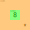

# Day three

For day three, we need to find a certain engine part for an elf engineer so we can go up a gondola lift. We need to find this part number within an engine schematic.

## Part one

For part one, we need to add up all part numbers that are adjecent to a symbol. These numbers can be adjacent horizontal, vertical or diagonal. This is what makes the challenge a bit difficult. Let's start creating a simple test for part one.

```rust,noplayground
#[test]
fn test_part_one() {
    let input_file: &str = "\
467..114..
...*......
..35..633.
......#...
617*......
.....+.58.
..592.....
......755.
...$.*....
.664.598..";

    let answer: i64 = 4361;

    assert_eq!(answer, part_one(input_file));
}
```

My first idea is to create a vector of every line, with every character in the line being stored in a vector. With this we can have a coordinate system, with the index in vector 1 being y and the index in vec 2 being x. This can be whipped up with a simple parser function.

```rust, noplayground
fn parser(file: &str) -> Vec<Vec<char>> {
    let map: Vec<Vec<char>> = file
        .lines()
        .map(|s| s.chars().collect())
        .collect();

    map
}
```

This function splits the input into lines and maps the characters in every line to a vector of characters. This makes it so that we have a 2 dimensional vector of all the characters in the map Now we need to find out if any number is adjacent to a special character. This problem is quite difficult to solve, so let's take a look at the conditions we need to add a number.

First, we need to check if any digit of a number is adjacent to a special character. We also need to get the full number to add to our answer. Because two special characters can be adjacent to the same number, I'm going to store the numbers so I don't have to deal with duplicate numbers. Let's try to find a digit in our array of characters first.

```rust,noplayground
let mut numbers: Vec<Number> = Vec::new();
let mut symbols: HashSet<(i64, i64)> = HashSet::new();

for (y, line) in map.iter().enumerate() {

    for (x, &ch) in line.iter().enumerate() {

        if ch.is_digit(10) {
            // get number + coords
        } else if ch != '.' {
            // get symbol coords
        } else {
            continue 
        }
    }
}
```

In this piece of code, we iterate over each line and each character, keeping track of the indices by using `enumerate()`. If we find a digit, we want to get the full number and the coordinates of the cells around the number. If we find a special character (that's not a `.`) we want to get the coordinates of that symbol only, so we can overlay the coordinates of the number's surroundings with the coordinates of the character.

Now let's go over getting the number and coordinates if we find a digit. I'm using a `struct` for this, so I can easily create new numbers and coordinate blocks around it. The code I used to find the full number and the coordinates around it is as follows.

```rust,noplayground
struct Number {
    value: i64,
    coords: HashSet<(i64, i64)>,
}

impl Number {
    fn new(x: usize, y: usize, map: &Vec<Vec<char>>) -> Self {
        let mut number: String = String::new();
        let mut coords: HashSet<(i64, i64)> = HashSet::new();

        for x in x..map.len() {
            if map[y][x].is_digit(10) {
                number.push(map[y][x]);

                let x = x as i64;
                let y = y as i64;

                coords.extend(HashSet::from([
                    (x - 1, y - 1), (x - 1, y), (x - 1, y + 1),
                    (x, y - 1), (x, y + 1),
                    (x + 1, y - 1), (x + 1, y), (x + 1, y + 1),
                ]));
            } else {
                break;
            }
        }

        Number {
            value: number.parse::<i64>().expect("Couldn't parse number!"),
            coords,
        }
    }
}
```

First, we create a struct that gets a full number as an `i64`, and gets a coordinate cloud as a `HashSet`. HashSets only take unique items, so every coordinate in the HashSet will be unique. I implemented a `new()` function for the number, to limit the amount of code in the `part_one()` function.

In the `new()` function, we start by initializing a string (which is an array of characters) and a HashSet for the coordinates. For every location from x through the length of the map, we check if the character at that location is a digit. If this is true, we append the character to the string, forming our number. We then get the 8 locations directly around the x of the character and add those to the HashSet. By using `extend()`, we can add a full vector. The `extend()` function will check if the coordinates already exist, eliminating double entries. If we don't find any digits anymore, we break out of the loop.

After that, we return the `Number` struct with the parsed value and the coordinate range around the number. There is one problem with the for loop. It will return the first full number and continue returning the consecutive digits, giving us way to much numbers. This can easily be fixed by skipping the iterations over the length of the number.

```rust,noplayground
let mut numbers: Vec<Number> = Vec::new();
let mut symbols: HashSet<(i64, i64)> = HashSet::new();

for (y, line) in map.iter().enumerate() {
    let mut n = 0;

    for (x, &ch) in line.iter().enumerate() {
        if n > 0 {
            n -= 1;
            continue;
        }

        if ch.is_digit(10) {
            let num = Number::new(x, y, &map);
            n += (num.value.to_string()).len() - 1;
            numbers.push(num);
        } //snip
    }
}
```

With this, we can skip every iteration over the length of the number we've just gotten. Now that that's out of the way, we need to get the coordinates of each character in the map. We already have a hashset for the symbols, so we just need to `extend()` the coordinates of our symbol.

```rust,noplayground
for (y, line) in map.iter().enumerate() {
        let mut n = 0;

        for (x, &ch) in line.iter().enumerate() {
            //snip
            if ch.is_digit(10) {
#                 let num = Number::new(x, y, &map);
#                 n += (num.value.to_string()).len() - 1;
#                 numbers.push(num);
            } else if ch != '.' {
                let coords = [
                    (x as i64, y as i64),
                ];
                symbols.extend(coords);
            } else {
                continue 
            }
        }
    }
```

Here, we just get the current `x` and `y` values as an `i64` and add them to our `HashSet`. Now let's just reiterate over what we've done. First, we map all the characters into a 2D vector and iterate over those characters. When we find a digit, we create a number out of it and skip the iterations over the length of the number to prevent the creation of non-existent numbers.



We get all the coordinates around a number and the coordinates of the symbols, and that's basically the point where we are now. To find which numbers we need to add up, we need to check if the coordinates around a number intersect with the coordinates of a symbol. Luckily, a `HashSet` has this great function called `intersection()`. To make the general idea a bit clearer, I've added an image. Here, the orange parts are the coordinates around our number. If we find a symbol in those coordinates (the `*` in this case) we want to see that as a part number.

Let's implement this in our code. Luckily, it is quite easy. We've gotten both coordinates in HashSets, so we can just `intersection()` them.

```rust,noplayground
for number in numbers {
    if number.coords.intersection(&symbols).next().is_some() {
        answer += number.value;
    }
}
```

We check the if the coordinates for each number intersect with the coordinates for each symbol. If that is true, we just add our number and we get our output!

## Part 2

For the second part, we need to find the gear ratios within our schematic. To find these, we need to find the 'gears', or `*` and multiply the two numbers next to it if we find just two numbers. Note that if we find 1 or 3 numbers, the calculation doesn't count. Let's start by writing a new test.

```rust,noplayground
#[test]
fn test_part_two() {
    let input_file: &str = "\
467..114..
...*......
..35..633.
......#...
617*......
.....+.58.
..592.....
......755.
...$.*....
.664.598..";

    let answer: i64 = 467835;

    assert_eq!(answer, part_two(input_file));
}
```

Now, let's copy our code from part one and make a few adjustments to it.

```rust,noplayground
let map = parser(input);
// snip
    let mut gears: HashSet<(i64, i64)> = HashSet::new();

    for (y, line) in map.iter().enumerate() {
        let mut n = 0;

        for (x, &ch) in line.iter().enumerate() {
            // snip
            if ch.is_digit(10) {
                // snip
            } else if ch == '*' {
                let coords = [
                    (x as i64, y as i64),
                ];
                gears.extend(coords);
            } else {
                continue 
            }
        }
    }
```

I've cut off the last few for loops, but what I mainly did here is renamed our `symbols` variable to `gears` (because we're looking for gears) and check if the character is a `*`, which is a gear. Now let's go over the search loop.

```rust,noplayground
for gear in gears {
    let mut hits: Vec<i64> = Vec::new(); 
    for number in &numbers {
        if number.coords.contains(&gear) {
            hits.push(number.value);
        }
    }
    if hits.len() == 2 {
        answer += hits[0] * hits[1];
    }
}
```

Here, we iterate over each gear in stead of each number. Within each gear, we gather the hits we got around the gear. We do this by iterating over each number and check if it's coordinates are the same as the coordinates of the gear. After we've looped over all numbers, we check if we just have 2 hits. If this is true, we multiply the two numbers we've found and add them to our answer.

Today was a bit difficult with the 2D vectors, but after preparing most work for part one, part two was significantly easier. If you want to check out the full file for day 3, take a look at the [repo](https://github.com/legoraft/aoc/tree/main/2023/day_03). To run the code with the test input, check out the [playground](https://play.rust-lang.org/?version=stable&mode=debug&edition=2021&gist=69fc7faa79dd1f893791158cea54f142).